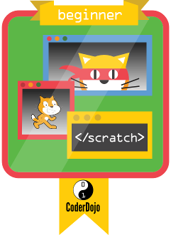

# Anfänger

Um den Anfänger Badge zu erhalten muss ein Programm erstellt werden, dass die nachfolgenden
Scratch Elemente enthält:

- Bewegen & Drehen von Figuren

- Tastaturbedienung

- Verwenden von X / Y Koordinaten um Figuren zu positionieren

- Ändern des Aussehens der Bühne und der Figuren mit Kostümen und "zeige dich" / "verstecke dich"

- "Wiederhole fortlaufen" Schleife

- Erkennen, wenn sich Figuren berühren
