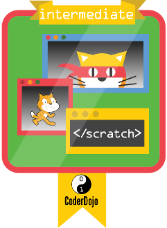

# Fortgeschrittene

Um den Badge für Fortgeschrittene zu erhalten muss ein Programm erstellt werden, dass die nachfolgenden
Scratch Elemente enthält:

- Das Zeichenstift-Werkzeug (Pen)

- Verwenden und Aktualisieren von Variablen in Schleifen

- Verwenden von "Wiederhole bis"-Schleifen (Repeat until)

- Erhalten von Eingabewerten mit Frage-Blöcken (Ask)

- Verwenden mehrere Listen und zugreifen auf die Listen mit Hilfe eines Index
